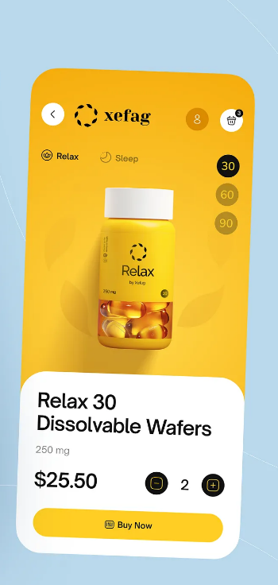

# Xefag Relax - UI Challenge

A React Native UI implementation of a product detail screen for **Xefag Relax** supplements, built with Expo and NativeWind (Tailwind CSS).



## Preview

The app displays a product detail page featuring:
- **Navigation bar** with back button, Xefag logo, user profile, and cart icons
- **Category tabs** for Relax and Sleep products
- **Dosage selector** (30, 60, 90 pills)
- **Product image** of the Relax supplement bottle
- **Product card** with title, dosage, price, quantity selector, and Buy Now button

##  Tech Stack

- **React Native** with Expo
- **TypeScript**
- **NativeWind** (Tailwind CSS for React Native)
- **Expo Router** (file-based routing)
- **Expo Vector Icons**

##  Project Structure

```
├── app/
│   ├── (tabs)/
│   │   ├── _layout.tsx      # Tab navigation layout
│   │   └── index.tsx        # Main product screen
│   └── _layout.tsx          # Root layout
├── components/
│   ├── Nav.tsx              # Navigation bar
│   ├── CategoryTabs.tsx     # Relax/Sleep category tabs
│   ├── DosageSelector.tsx   # 30/60/90 pill selector
│   ├── ProductCard.tsx      # Product details card
│   └── QuantitySelector.tsx # +/- quantity controls
├── assets/
│   └── images/
│       ├── xefag.png        # Xefag logo
│       └── relax-bottle.png # Product bottle image
└── global.css               # Global styles with Tailwind
```

##  Getting Started

### Prerequisites
- Node.js (v18+)
- npm or yarn
- Expo Go app on your phone (for testing)

### Installation

1. Install dependencies:
   ```bash
   npm install
   ```

2. Start the development server:
   ```bash
   npx expo start
   ```

3. Scan the QR code with Expo Go (Android) or Camera app (iOS)

##  Notes

This is a **UI-only implementation** - no functionality is wired up. The components are static and display the design as shown in the mockup.

##  Design

The UI is based on a modern e-commerce product detail page design featuring:
- Golden yellow brand color (`#f5b207`)
- Cream/beige product card (`#e8e4d9`)
- Clean typography and rounded elements
- Intuitive quantity and dosage selection UI
